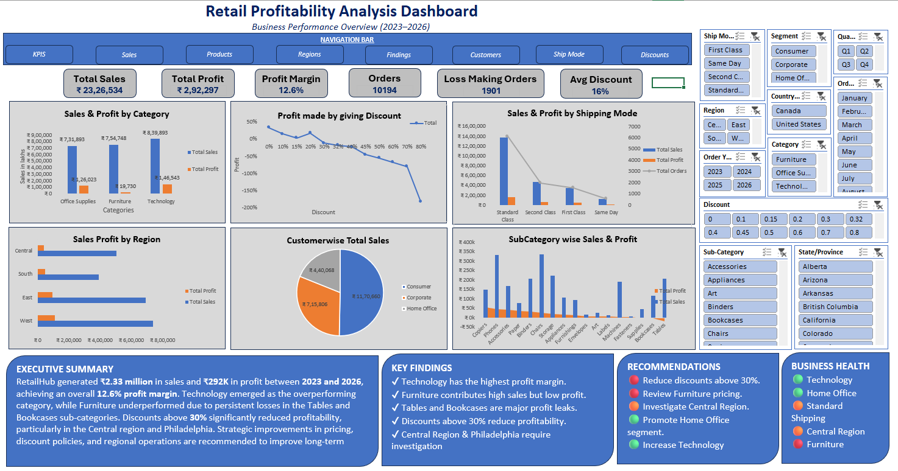

# 📊 Retail Profitability Analysis Dashboard (Microsoft Excel)

## 📌 Project Overview

This project presents an end-to-end Retail Profitability Analysis developed entirely in Microsoft Excel.

The objective was to investigate why increasing sales were not translating into proportional profit growth and to provide actionable business recommendations through an executive dashboard.

The project simulates a real-world retail business scenario where management requires data-driven insights for strategic decision-making.

---

## 🎯 Business Problem

Although RetailHub experienced continuous sales growth over four years, profitability remained inconsistent.

Management wanted answers to the following questions:

- Which products are truly profitable?
- Which categories generate losses?
- Are discounts helping or hurting profits?
- Which regions require attention?
- Which customers should be prioritized?
- Is the current shipping strategy effective?

---

## 🛠 Tools Used

- Microsoft Excel 2019
- Pivot Tables
- Pivot Charts
- KPI Cards
- Slicers
- Conditional Formatting
- Structured Tables
- Excel Formulas
- Dashboard Design

---

## 📈 Dashboard Preview

> *(Add your dashboard screenshot here)*

---

## 📊 Key KPIs

- Total Sales
- Total Profit
- Profit Margin
- Total Orders
- Total Customers
- Loss-Making Orders

---

## 🔍 Business Analysis Performed

- Sales Trend Analysis
- Category & Sub-Category Analysis
- Customer Segment Analysis
- Regional Performance Analysis
- Shipping Analysis
- Discount Impact Analysis
- Profitability Analysis

---

## 💡 Key Findings

- Technology is the highest-performing category in terms of profitability.
- Furniture contributes significant sales but generates very low profit.
- Tables and Bookcases are major profit-leaking sub-categories.
- Discounts above 30% significantly reduce profit margins.
- Central Region and Philadelphia require operational review.
- Home Office customers generate the highest profit margin.

---

## ✅ Recommendations

- Review Furniture pricing strategy.
- Reduce discounts above 30%.
- Expand Technology product offerings.
- Investigate Central Region operations.
- Increase marketing efforts for Home Office customers.

---

## 🚀 Skills Demonstrated

- Data Cleaning
- Exploratory Data Analysis (EDA)
- Business Analytics
- Dashboard Design
- KPI Development
- Business Storytelling
- Executive Reporting
- Data Visualization
- Microsoft Excel

---

## 👨‍💻 Author

**Suyash Varkar**
